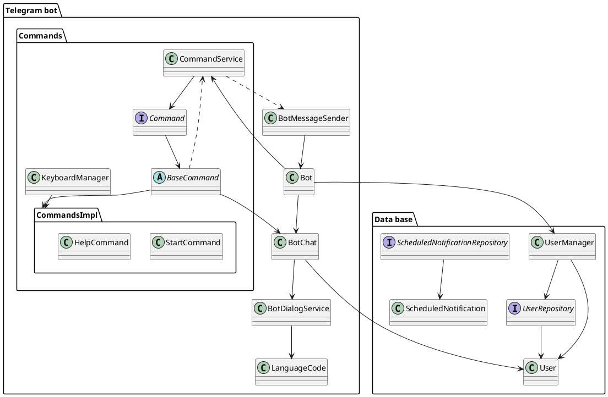

# Class diagram

```plantuml
@startuml
package "Telegram bot" {
    class Bot
    
    class BotChat
    Bot --> BotChat
    
    class BotDialogService
    BotChat --> BotDialogService

    class LanguageCode
    BotDialogService --> LanguageCode

    class BotMessageSender
    BotMessageSender --> Bot

    package "Commands" {
        class CommandService
        
        interface Command
        CommandService --> Command

        abstract class BaseCommand
        Command --> BaseCommand
        BaseCommand ..> CommandService
        
        package CommandsImpl {
            class StartCommand
            class HelpCommand
        }
        BaseCommand --> CommandsImpl
        BaseCommand --> BotChat

        class KeyboardManager
        KeyboardManager --> CommandsImpl
        
    }

    CommandService ..> BotMessageSender
    Bot --> CommandService
}

package "Data base" {

    class UserManager
    Bot --> UserManager

    interface UserRepository
    UserManager --> UserRepository

    class User
    UserRepository --> User
    UserManager --> User

    interface ScheduledNotificationRepository
    class ScheduledNotification
    ScheduledNotificationRepository --> ScheduledNotification
}

BotChat --> User

@enduml
```