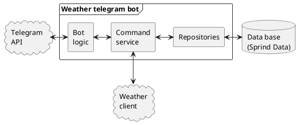
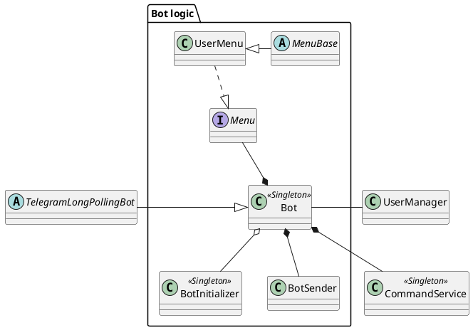
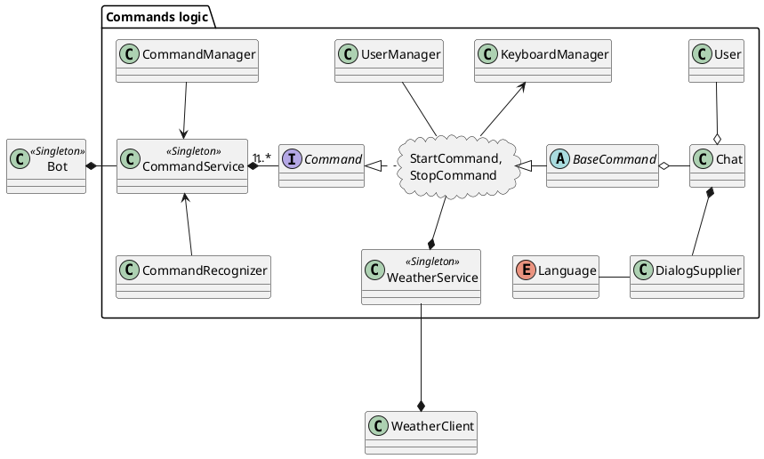
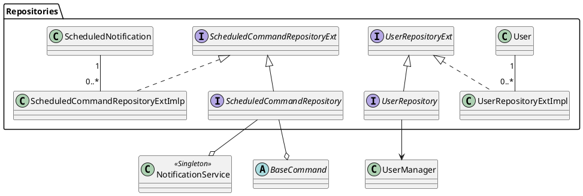

# Bot design

## Common scheme

```plantuml
@startuml

cloud TelegramApi [
    Telegram
    API
]

frame TelegramBot as "Weather telegram bot" {
    rectangle BotLogic [
        Bot
        logic
    ]
    rectangle CommandService [
        Command
        service
    ]
    rectangle Repositories [
        Repositories
    ]
}

cloud WeatherClient [
    Weather
    client
]

database DataBase [
    Data base 
    (Sprind Data)
]

TelegramApi <-> BotLogic
BotLogic <-> CommandService
CommandService <-> Repositories
CommandService <-down-> WeatherClient
Repositories <-> DataBase

@enduml
```

## Bot logic

```plantuml
@startuml

abstract class TelegramLongPollingBot

package "Bot logic" {
    class Bot <<Singleton>>
    Bot <|-left-  TelegramLongPollingBot

    class BotInitializer <<Singleton>>
    Bot o-down- BotInitializer  
    
    class BotSender
    Bot *-down- BotSender

    interface Menu
    Bot *-up- Menu 

    class UserMenu
    Menu <|.up. UserMenu

    abstract class MenuBase
    UserMenu <|- MenuBase
}

class UserManager
Bot -right- UserManager

class CommandService <<Singleton>>
Bot *-- CommandService

@enduml
```

## Command service

```plantuml
@startuml

class Bot <<Singleton>>

package "Commands logic" {
    class CommandService <<Singleton>>
    CommandService --left-* Bot

    class CommandManager
    CommandService <-up- CommandManager

    class CommandRecognizer
    CommandService <-down- CommandRecognizer

    interface Command
    CommandService "1"*-right-"1..*" Command


    cloud CommandsImpl [
        StartCommand,
        StopCommand
    ]
    Command <|.right. CommandsImpl

    class UserManager
    CommandsImpl -up- UserManager

    class KeyboardManager
    CommandsImpl -up-> KeyboardManager

    abstract class BaseCommand
    CommandsImpl <|-right- BaseCommand

    class WeatherService <<Singleton>>
    CommandsImpl -down-* WeatherService

    class Chat
    BaseCommand o-right- Chat

    class User
    Chat o-up- User
        
    class DialogSupplier
    Chat *-down- DialogSupplier

    enum Language
    DialogSupplier -left- Language
}

class WeatherClient
WeatherService --down-* WeatherClient

@enduml
```

## Repositories

```plantuml
@startuml

class UserManager
class NotificationService <<Singleton>>
abstract class BaseCommand

package "Repositories" {

    interface UserRepositoryExt

    class UserRepositoryExtImpl implements UserRepositoryExt

    interface UserRepository extends UserRepositoryExt
    UserRepository -down-> UserManager

    class User
    User "1"--"0..*" UserRepositoryExtImpl
    
    interface ScheduledCommandRepositoryExt
    
    class ScheduledCommandRepositoryExtImlp implements  ScheduledCommandRepositoryExt

    interface ScheduledCommandRepository extends ScheduledCommandRepositoryExt
    ScheduledCommandRepository -down-o BaseCommand 
    ScheduledCommandRepository -down-o NotificationService

    class ScheduledNotification
    ScheduledNotification "1"--"0..*" ScheduledCommandRepositoryExtImlp
    
} 

@enduml
```
